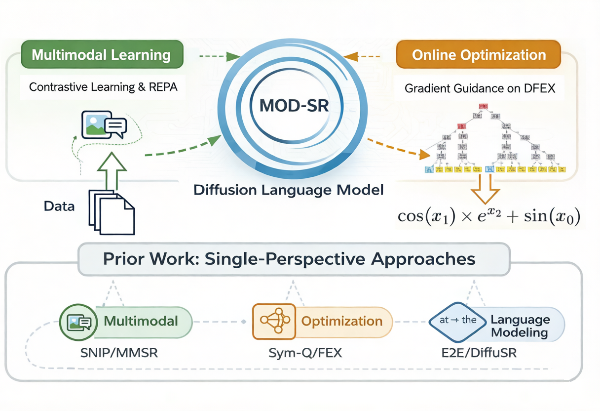
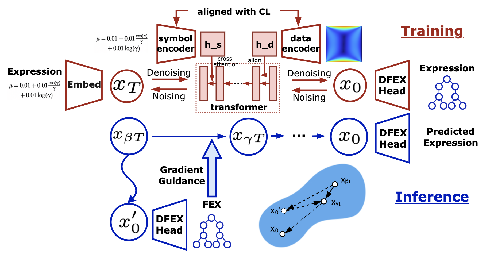
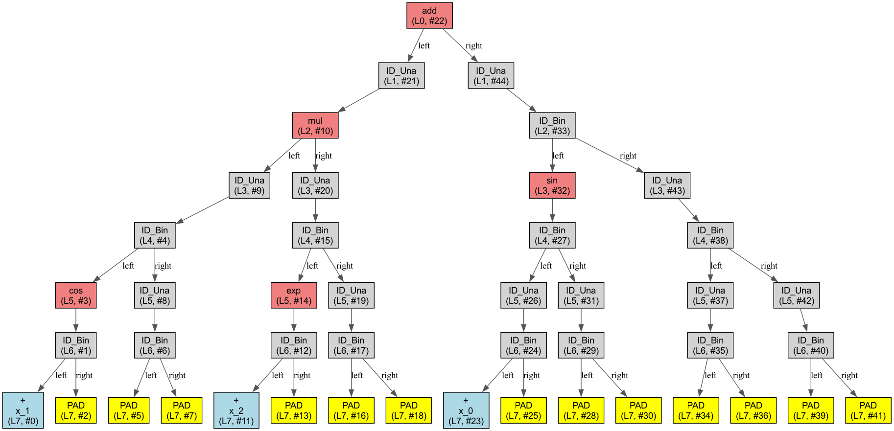

# MOD-SR: Unifying Multimodal Learning and Direct Optimization with Gradient-Guided Diffusion Model for Symbolic Regression



Official codebase for **[ICML2026] MOD-SR: Unifying Multimodal Learning and Direct Optimization with Gradient-guided Diffusion for Symbolic Regression**.  [Paper](https://openreview.net/forum?id=p06oR4sXgz).

MOD-SR studies symbolic regression as a multimodal conditional generation problem. The project is built on a diffusion backbone and integrates three key ideas: stronger multimodal conditioning with SNIP-style encoders, representation alignment with a pretrained symbolic teacher, and test-time gradient guidance through a fixed-tree executable representation.



## Introduction

### Highlights

- **Diffusion-based symbolic regression**: generate expressions in continuous representation space instead of purely autoregressive token decoding.
- **Multimodal conditioning**: support both E2E and SNIP numeric encoders; the SNIP branch uses token-wise pre-pooled features for cross-attention.
- **REPA alignment**: align intermediate diffusion features with a frozen SNIP symbolic encoder.
- **FEX execution space**: convert expressions into a fixed-tree representation for differentiable execution and structural guidance.
- **Gradient guidance**: inject objective gradients during sampling to steer generation toward lower regression error or simpler expressions.

### Repository Structure

- `symbolicregression/model/diffusr_full.py`: main diffusion model, training objective, and sampling.
- `symbolicregression/model/guidance_runner.py`: gradient guidance and relaxed optimization logic.
- `symbolicregression/envs/fixed_tree_encoder.py`: fixed-tree DFEX representation and fast decode.
- `symbolicregression/envs/inner_loop_executor.py`: differentiable relaxed execution over DFEX trees.
- `train_diffusr_full.py`: main training entry for diffusion-based symbolic regression.
- `train_fex_head.py`: train the DFEXHead.
- `train_snip_latent_ae.py`: train SNIP-based latent autoencoders (global or token-wise).

## Method

MOD-SR consists of four main components.

### Diffusion Backbone

The main generator follows the DiffuionLM-style formulation: symbolic expressions are embedded into a continuous sequence space, corrupted by Gaussian noise, and denoised by a Transformer decoder conditioned on numerical observations.

### SNIP / E2E Conditioning

Numerical observations are encoded by a frozen conditional encoder.

- **E2E**: directly uses the original sequence encoder.
- **SNIP**: uses token-wise pre-pooled features rather than only a pooled latent vector, then projects them to the generator hidden space.

This gives the diffusion model richer multimodal conditioning while keeping the encoder frozen.

Note that there exists some inconsistency between the repo and the paper. In the paper, we stated that we were using SNIP conditioning. However, we later found E2E conditioning slightly better.

### REPA Alignment

To improve the internal semantic structure of the diffusion model, we align intermediate hidden states with token-wise features from a frozen SNIP symbolic encoder (`encoder_f`). This is implemented as an auxiliary cosine-similarity loss through a lightweight projection head.

### DFEX + Gradient Guidance

For optimization-aware sampling, expressions are mapped into a fixed-tree executable representation (DFEX). We refer to the FEX repository: [Finite-expression-method](https://github.com/LeungSamWai/Finite-expression-method). This enables:

- position-wise structural constraints,
- differentiable relaxed execution,
- subtree-level freezing / perturbation,
- objective-aware gradient guidance during sampling.



## Environment Setup

All codes were tested on Python 3.11 and we supported both NVIDIA's CUDA and Huawei's Ascend:

- **GPU**: Install dependencies via `requirements.txt` (GPU-enabled PyTorch required).
- **NPU**: Use `requirements_npu.txt` (note: PyTorch not included; please refer to official NPU documentation for PyTorch installation). Tested on PyTorch 2.3.0 and PyTorch 2.1.0.

## Frozen Weights Preparation

We need E2E / SNIP encoder for our pipeline.
- **SNIP Weights:** Get them from [here](https://drive.google.com/file/d/1jfkQdTvGibGwVqWHVIjQ_fxyBtV4EcoY/view?usp=share_link)
- **E2E Weights:** Available [here](https://dl.fbaipublicfiles.com/symbolicregression/model1.pt)

Please put the two weights in `weights/`.


## Training & Inference

Please refer to `run_modsr.sh`

## Citation
```tex
@inproceedings{xiang2026modsr,
  title={{MOD}-{SR}: Unifying Multimodal Learning and Direct Optimization with Gradient-Guided Diffusion Model for Symbolic Regression},
  author={Xiang, Chuyang and Wei, Yichen and Yan, Junchi},
  booktitle={Forty-third International Conference on Machine Learning},
  year={2026},
  url={https://openreview.net/forum?id=p06oR4sXgz}
}
```

## License

This project is licensed under the MIT License (Copyright 2025 Chuyang Xiang).

Portions of this project are derived from the Facebook Research Symbolic Regression 
project (https://github.com/facebookresearch/symbolicregression), licensed under 
Apache License 2.0. See ATTRIBUTION.md for details.